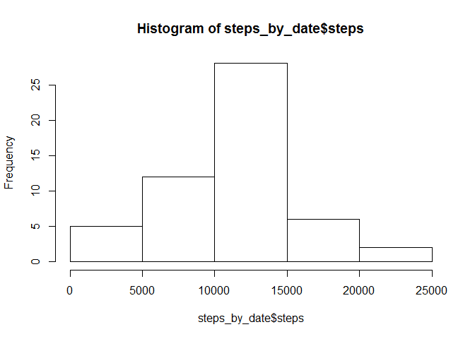
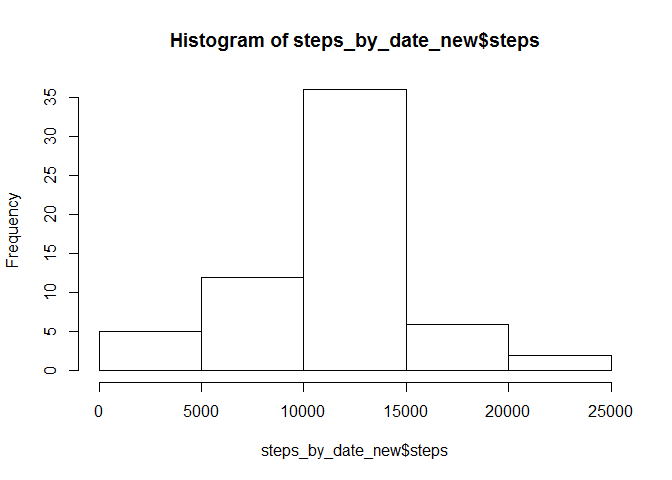

# Reproductible Research: Peer Assessment 1


### Loading and preprocessing the data


```r
activity <- read.csv("activity/activity.csv", header = TRUE, stringsAsFactors = FALSE)
activity$steps <- as.numeric(activity$steps)
activity$date <- as.Date(activity$date, "%Y-%m-%d")
head(activity)
```

```
##   steps       date interval
## 1    NA 2012-10-01        0
## 2    NA 2012-10-01        5
## 3    NA 2012-10-01       10
## 4    NA 2012-10-01       15
## 5    NA 2012-10-01       20
## 6    NA 2012-10-01       25
```

### What is mean total number of steps taken per day?
Calculate the total number of steps taken per day

```r
steps_by_date <- aggregate(steps ~ date, data = activity, FUN = "sum")
```
Make a histogram of the total number of steps taken each day

```r
hist(steps_by_date$steps)
```

 

Calculate and report the mean and median of the total number of steps taken per day

```r
mean(steps_by_date$steps, na.rm = TRUE)
```

```
## [1] 10766.19
```

```r
median(steps_by_date$steps, na.rm = TRUE)
```

```
## [1] 10765
```

### What is the average daily activity pattern?
Make a time series plot (i.e. type = "l") of the 5-minute interval (x-axis) and the average number of steps taken, averaged across all days (y-axis)

```r
steps_by_interval <- aggregate(steps ~ interval, data = activity, FUN = "mean")
plot(steps_by_interval$interval, steps_by_interval$steps, type = "l")
```

 

Which 5-minute interval, on average across all the days in the dataset, contains the maximum number of steps?

```r
max(steps_by_interval$steps)
```

```
## [1] 206.1698
```

```r
steps_by_interval$interval[which.max(steps_by_interval$steps)]
```

```
## [1] 835
```

### Imputing missing values
Calculate and report the total number of missing values in the dataset (i.e. the total number of rows with NAs)

```r
missing_values <- sum(is.na((activity$steps)))
```
There are 2304 missing values.

Devise a strategy for filling in all of the missing values in the dataset. The strategy does not need to be sophisticated. For example, you could use the mean/median for that day, or the mean for that 5-minute interval, etc
My strategy is to replace it with the daily mean. I replace the N/A in the newly created set

```r
activity_new <- activity
```
Create a new dataset that is equal to the original dataset but with the missing data filled in

```r
activity_new[is.na(activity$steps), ]$steps <- (mean(steps_by_date$steps, na.rm = TRUE)/(24*12))
head(activity_new)
```

```
##     steps       date interval
## 1 37.3826 2012-10-01        0
## 2 37.3826 2012-10-01        5
## 3 37.3826 2012-10-01       10
## 4 37.3826 2012-10-01       15
## 5 37.3826 2012-10-01       20
## 6 37.3826 2012-10-01       25
```
Make a histogram of the total number of steps taken each day

```r
steps_by_date_new <- aggregate(steps ~ date, data = activity_new, FUN = "sum")
hist(steps_by_date_new$steps)
```

 

Calculate and report the mean and median of the total number of steps taken per day

```r
mean(steps_by_date_new$steps, na.rm = TRUE)
```

```
## [1] 10766.19
```

```r
median(steps_by_date_new$steps, na.rm = TRUE)
```

```
## [1] 10766.19
```
Do these values differ from the estimates from the first part of the assignment? What is the impact of imputing missing data on the estimates of the total daily number of steps?

The mean value is the same and the median value slighly changed. This is because the missing values were for entire days and they were replaced with the average per day.


### Are there differences in activity patterns between weekdays and weekends?
Create a new factor variable in the dataset with two levels - "weekday" and "weekend" indicating whether a given date is a weekday or weekend day.

```r
activity_new$is_weekend <- "weekday"
head(activity_new)
```

```
##     steps       date interval is_weekend
## 1 37.3826 2012-10-01        0    weekday
## 2 37.3826 2012-10-01        5    weekday
## 3 37.3826 2012-10-01       10    weekday
## 4 37.3826 2012-10-01       15    weekday
## 5 37.3826 2012-10-01       20    weekday
## 6 37.3826 2012-10-01       25    weekday
```

```r
for (i in 1:dim(activity_new)[1]) {
    wd <- weekdays(as.Date(activity_new$date[i]))
    if (wd == "Sunday" | wd == "Saturday") {
        activity_new$is_weekend[i] <- "weekend"
    }
}
activity_new$is_weekend <- as.factor(activity_new$is_weekend)
```
Make a panel plot containing a time series plot (i.e. type = "l") of the 5-minute interval (x-axis) and the average number of steps taken, averaged across all weekday days or weekend days (y-axis). See the README file in the GitHub repository to see an example of what this plot should look like using simulated data.

```r
steps_by_interval_new <- aggregate(steps ~ interval + is_weekend, data = activity_new, 
    FUN = "mean")
head(steps_by_interval_new)
```

```
##   interval is_weekend    steps
## 1        0    weekday 7.006569
## 2        5    weekday 5.384347
## 3       10    weekday 5.139902
## 4       15    weekday 5.162124
## 5       20    weekday 5.073235
## 6       25    weekday 6.295458
```

```r
library(lattice)
xyplot(steps ~ interval | is_weekend, steps_by_interval_new, layout = c(1, 2), type = "l")
```

 

On the weekdays there is a pick of steps around 8:30 AM. There is a such peack on the weekend too, but it is smaller.

